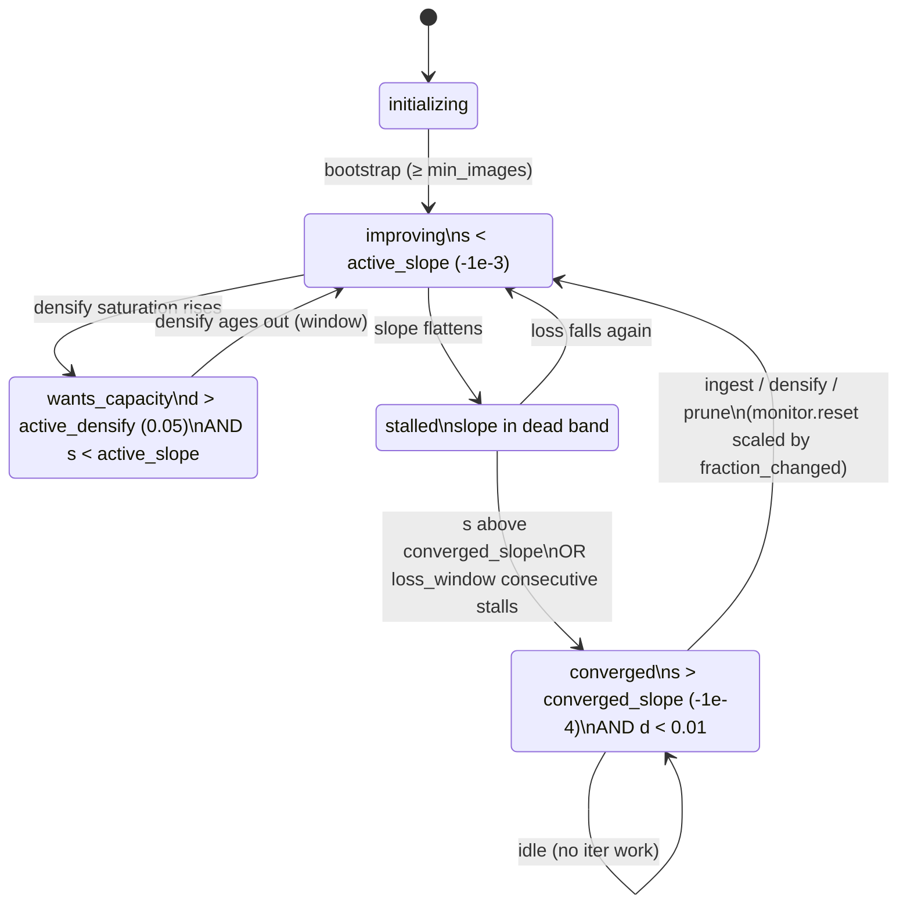

# Continuous MEGS² pipeline

Umbrella reference for `continuous_train.py` — the streaming trainer that
receives COLMAP snapshots from the home-server SfM app and maintains a
Gaussian-splat model until convergence, forever.

Companion docs:

- [ingest_contract.md](ingest_contract.md) — HTTP contract with the
  home-server (`/ingest`, `/health`, splat export, match matrix, ports).
- [continuous_ops.md](continuous_ops.md) — events.jsonl, crash
  recovery/`--resume`, always-on invariants, regression harness.
- [dense_init_backends.md](dense_init_backends.md) — DAv2 vs DA3 dense
  init, benchmark workflow.

## Component map

| Piece | File | Role |
|---|---|---|
| Trainer loop | `continuous_train.py` | drain ingests, optimize, fire triggers, snapshot |
| HTTP server | `scene/continuous_server.py` | `/ingest`, `/health`, `/status`, `/checkpoint` |
| Shared state | `scene/control_state.py` | queue, idempotency ledger, status mirror |
| Scene stream | `scene/progressive_scene.py` | cumulative COLMAP snapshot loading |
| Model | `scene/spherical_gaussian_model.py` | cohort-based spherical-Gaussian model |
| Convergence | `scene/convergence.py` | loss-slope + densify-saturation state machine |
| Triggers | `scene/triggers.py` | densify/prune/cull predicates |
| SkipGS | `scene/skipgs.py` | late-phase backward gating |
| Dense init | `scene/dense_init.py` | DAv2/DA3 monocular depth seeding |
| Index bookkeeping | `scene/index_remap.py` | flat-order maps under cohort appends/prunes |
| Guards | `scene/optim_guard.py` | Adam state-binding invariant |
| Weighting | `scene/match_matrix.py` | co-visibility → per-camera weights |

## Main loop (one iteration)

1. **Checkpoint handshake** — if `POST /checkpoint` is pending, write
   `current.ply` (mirrored to the export dir) and release the waiter.
2. **Drain ingest queue** — for each snapshot: `add_snapshot` (new cameras
   + new sparse points), first-snapshot `create_from_pcd` or
   `expand_from_pcd` for new points, dense init for new images, match
   matrix (or uniform-weight fallback), `monitor.reset(fraction_changed)`,
   SkipGS re-arm, invariant check, `ingest` event.
3. **Bootstrap gate** — no optimization until `bootstrap.min_images`
   (default 4) images have arrived.
4. **Converged-idle gate** — when state is `converged` with an empty
   queue: fire the once-per-cycle SG axis cull if its predicate passes,
   write `current.ply` + `train_state.pt` once per cycle, then block in
   `wait_for_work` (no GPU burn while idle).
5. **Optimizer step** — K = `accumulation_views` forwards with
   error-EMA-biased camera selection, SkipGS gating of the gradient sum,
   one backward + Adam step; then densify / fast-prune / lightweight-prune
   triggers (each behind its predicate + invariant check), periodic
   `train_state.pt` save.

## Convergence state machine

States come from `ConvergenceMonitor.state()`; the trainer snapshots the
state once at iter start (`cur_state`) and every trigger in that iter sees
that same snapshot. `s` = relative loss slope over `loss_window` (200)
EMA-loss samples; `d` = max densify fraction within the last window.

Details that matter (all pinned by tests/test_convergence.py):

- Too little history → slope is −inf → `improving`. After
  `monitor.reset(fraction_changed=f)`, only `max(10, window·f)` fresh
  samples are needed before the slope is trusted again — small trims
  re-detect convergence quickly, big changes need a full window.
- Densify saturation ages out by iteration (entries older than one
  loss_window are ignored), so one past densify can't pin
  `wants_capacity` forever.
- `loss_window` consecutive `stalled` reads promote to `converged`
  (stalled-timeout), so the trainer can idle instead of grinding just
  outside the converged band.
- `monitor.cycle` increments on every reset; the SG axis cull and the
  once-per-cycle snapshot write key off it.

## Trigger reference

All predicates live in `scene/triggers.py`; require-states and floors come
from `configs/continuous.yaml` `triggers:`. Every firing emits a JSONL
event and runs `check_invariants`.

| Trigger | Fires in state | Floor (iters) | Evidence condition | Action |
|---|---|---|---|---|
| densify | stalled, wants_capacity | 60 | grads settled (`denom ≥ 10` on ≥50% seen) AND clone+blur candidates > 0.5% of N; gated on N < ceiling | clone + split, grace-aware trailing prune |
| fast_prune | stalled, converged | 200 | dead (opacity < 0.005) fraction > 2% | opacity/size prune, grace-aware |
| lightweight_prune | converged (growth path) — cap breach fires in ANY state with no floor | 100 | N > soft cap (0.85·ceiling), or ≥10% growth since last prune | bottom-5% importance prune, grace-aware |
| cull_sg_axes | converged, once per cycle (idle gate only) | 500 | ≥20% of SG axes below sharpness 1.0 | axis cull, then monitor.reset(0.3) |

After any trigger changes the model, `monitor.reset(fraction_changed)` is
called with the actual fraction added/removed, which re-arms convergence
detection proportionally.

## Checkpoint / resume

See [continuous_ops.md](continuous_ops.md). Short version:
`train_state.pt` is written every `training.train_state_interval_iters`
(500) iters and at each converged-idle transition; restart with `--resume`
to restore model + Adam + monitor + SkipGS + ingest ledger + loop
counters after re-ingesting the last cumulative snapshot.

## VRAM budget (6 GB GTX 1660 Ti target)

Measured envelope from the field sessions (~13 images / ~800 k splats
steady state):

| Consumer | Approx | Notes |
|---|---|---|
| Training residency (model + optimizer + activations) | ~1.5 GB | scales with splat count; K=4 accumulation adds per-view intermediates |
| `num_max_ceiling` 800 k | — | the one hard cap; soft cap 0.85· for prune pressure |
| DAv2-small (per-ingest context) | ~+0.5 GB | freed before training resumes; `persist_model: true` holds it (~1.3 GB for large) |
| DA3-SMALL (per-ingest context) | measure with `tools/bench_dense_init.py` | same sequential-context discipline; per-image DAv2 fallback also sequential |
| Headroom | ~4.5 GB free at steady state | why DAv2-large / DA3-BASE are plausible upgrades |

Rules encoded in code: depth models are never co-resident with each other
or grow past their context (>100 MB residue logs a warning);
`ceiling_exceeded` is an invariant event; dense init self-caps at the
ceiling.

## Dense-init backend choice

See [dense_init_backends.md](dense_init_backends.md). Default `dav2`;
flip to `da3` only with a committed benchmark table from the target
machine.

## Config reference (configs/continuous.yaml)

Dataclasses in `continuous_train.py` are the source of truth; yaml keys
apply by name. Unknown keys are ignored silently — typos don't error.

| Section | Key (default) | Meaning |
|---|---|---|
| convergence | loss_window (200), densify_window (10) | monitor history lengths |
| | converged_slope (−1e-4), active_densify (0.05), active_slope (−1e-3) | state thresholds |
| triggers.\<name\> | min_iters_between, require_state | per-trigger floor + allowed states |
| skipgs | enabled (true), warmup_steady_samples (50), beta (0.95), rho_lo (0.5) | backward gating |
| bootstrap | min_images (4) | optimization gate |
| training | accumulation_views (4) | K forwards per optimizer step |
| | num_max_ceiling (800000) | hard splat cap (VRAM-bounded) |
| | densify_min_obs (10), densify_candidate_fraction (0.005) | densify evidence |
| | fast_prune_dead_fraction (0.02) | fast-prune evidence |
| | lightweight_prune_growth_threshold (0.10), prune_ratio1 (0.05) | importance prune |
| | sg_axis_cull_low_fraction (0.20), sharpness_threshold (1.0) | axis cull |
| | imp_metric (outdoor), imp_score_camera_subsample (0) | importance scoring |
| | image_error_weighting (true), image_error_ema_beta (0.95) | selection bias |
| | train_state_interval_iters (500) | crash-recovery cadence |
| dense_init | enabled (true), backend (dav2), da3_fallback_to_dav2 (true) | seeding pipeline |
| | min_sfm_points_for_alignment (10), min_sfm_depth_range_fraction (0.10) | per-image gates |
| | target_dense_points_per_image (30000), novelty_distance_threshold (0.01) | point budget |
| | depth_disagreement_threshold (0.10), max_rejected_fraction (0.5) | sanity filter |
| | grace_iters (20), persist_model (false) | protection / DAv2 persistence |
| | dav2.model_size (small), dav2.fp16 (true) | DAv2 settings |
| | da3.model_name (DA3-SMALL), da3.conditioning (true), da3.process_res (504) | DA3 settings |
| ransac (under dense_init) | iterations (200), inlier_threshold (0.05), min_inliers (8) | depth alignment |
| http | host (127.0.0.1), port (8666), checkpoint_timeout (30) | control server |
